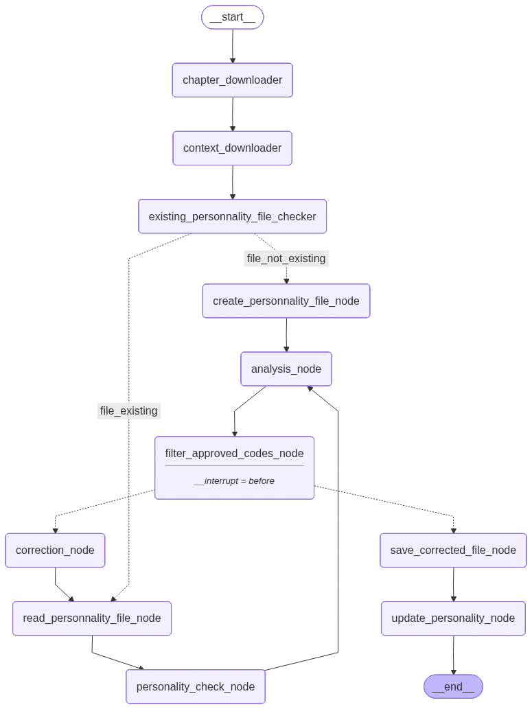

# AI Narrative Consistency Agent 📚🤖

## Description of the Use Case

Writing long-form fiction requires maintaining strict consistency across chapters regarding character personalities, timeline logic, and historical accuracy. This project implements an **AI-powered "Continuity Editor" Agent** using LangGraph and GPT-4o.

**Important** As our API-key crashed and we're waiting for a new one, we were able to test all the model, except for the node "update_personnality_node".

The workflow is designed to assist authors by automating the review process of new chapters.
**Key capabilities include:**

1.  **Personality Consistency Check:** Compares the character's actions in the new chapter against a persistent `personnality.txt` database to detect out-of-character behaviors.
2.  **Logical & Anachronism Analysis:** Scans the text for plot holes (e.g., using an object not yet acquired) or historical errors (e.g., using a smartphone in the Middle Ages).
3.  **Human-in-the-Loop:** An interactive stop mechanism allows the human author to review detected errors and approve or reject them before any changes are made.
4.  **Auto-Correction:** The agent rewrites only the specific passages containing approved errors.
5.  **Dynamic Knowledge Update:** Once a chapter is finalized, the agent extracts new character attributes and updates the `personnality.txt` file, ensuring the "memory" of the story evolves chapter by chapter.

---

## Diagram of the Final Graph

The following diagram represents the LangGraph workflow implemented in this project:

# Installation & Setup

## 1. Prerequisites
* **Python 3.10** or higher.
* A valid **OpenAI API Key**.
* **Jupyter Notebook** or **VS Code** (to run the `.ipynb` file).

## 2. Install Dependencies
Run the following command to install the required Python packages:

    uv add -r requirements.txt

## 3\. Environment Configuration

Create a file named `.env` in the root directory of your project and add your OpenAI API key:

    OPENAI_API_KEY=sk-proj-xxxxxxxxxxxxxxxxxxxxxxxx

## ⚠️ Critical Configuration: File Paths

The script currently uses **hardcoded paths** pointing to a local directory. You **must** update these paths to match your own folder structure before running the model.

1.  Open the code/notebook.
2.  Search for the following string:
    `C:\\Documents\Pro\\11-Designing_Agentic_Systems\\`
3.  Replace **every instance** of this path with the absolute path to your project folder.

You will need to update paths in the following functions:

  * `chapter_downloader_node`
  * `context_downloader_node`
  * `create_personnality_file_node`
  * `read_personnality_file_node`
  * `existing_personnality_file_checker`
  * `save_corrected_file_node`
  * `update_personality_node`

> **Tip:** If you are on Windows, remember to use double backslashes `\\` or prefix your string with `r` (e.g., `r"C:\My\Folder\..."`) to avoid syntax warnings.

-----

## Instructions on How to Run

This project is designed to be run as a **Jupyter Notebook**.

### 1\. Prepare your inputs

  * Place your chapter PDF file in your configured folder.
      * *Note: The filename must contain the word "chapter" and the number of the chapter (e.g., `Chapter_01.pdf`).
  * Place a `Contexte.txt` file in the folder that should define a start point. It must have the date of the story and if there are multiple timelines.

  * Two files are uploaded as an example ("Chapter 1 - Emma" and "Contexte"). The user can delete them and add his own files.

### 2\. Start the Notebook

Run the notebook cells sequentially:

1.  **Cell 1:** Imports, Class definitions, and Graph Compilation.
2.  **Cell 2:** The Execution Loop (Runtime).

### 3\. Interact with the Agent

The Agent will analyze the text and pause. It will display a list of detected errors (**P-Codes** for Personality, **LA-Codes** for Logic).

  * **Input:** In the input box, type the codes you want to fix separated by commas (e.g., `P1, LA2`).
  * **Skip:** Press **Enter** without typing anything if you want to skip corrections and finish the process.

### 4\. Results

  * If you requested corrections, the agent will **rewrite the text** and loop back for re-verification.
  * Once finished, a new file `chapter-corrected.txt` will be created.
  * The `personnality.txt` file will be automatically updated with new character details extracted from the chapter.

**Licence**
All of this folder is under a creative commons licence.
It needs attribution and it can't be use for commercial purpose.